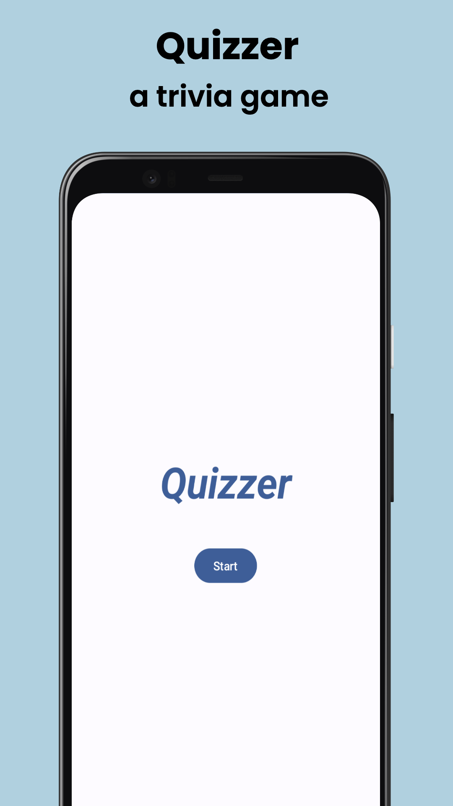
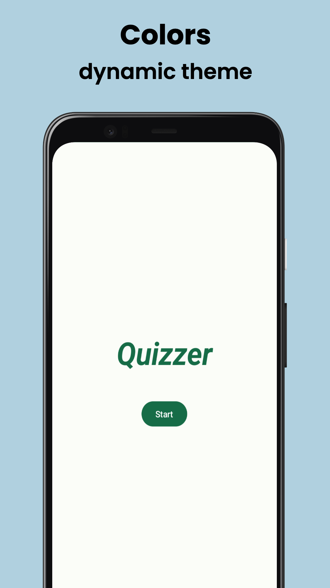
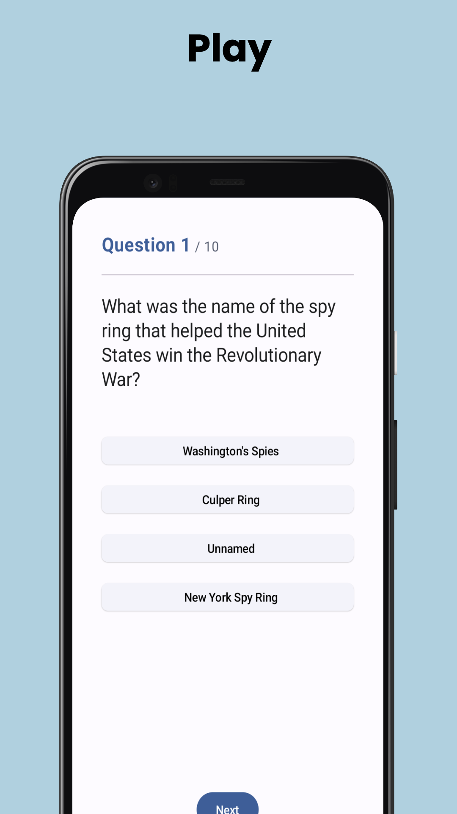
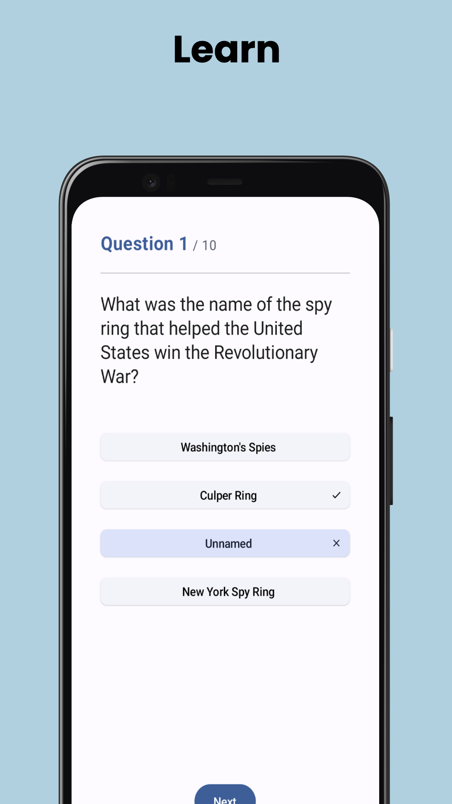
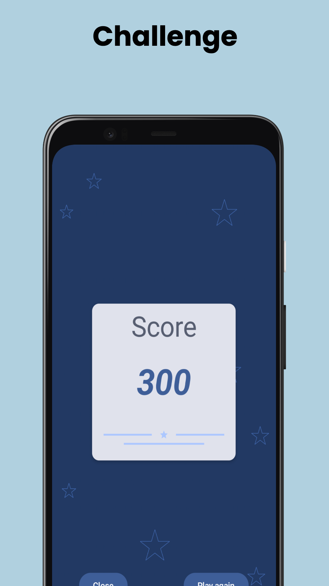

# QUIZZER
Engage in a fun and entertaining way of testing your knowledge on a wide range of topics with a trivia game.

  
  
  
  
  

Screenshots made with [Screenshots.pro](https://screenshots.pro/)

## Android Components

- [Architecture](https://github.com/googlesamples/android-architecture-components)

- [Kotlin](https://kotlinlang.org/)

- [Jetpack Compose](https://developer.android.com/jetpack/compose)

- [Jetpack View Model](https://developer.android.com/topic/libraries/architecture/viewmodel)

- [Jetpack Lifecycle](https://developer.android.com/topic/libraries/architecture/lifecycle)

- [Material 3](https://m3.material.io/get-started)

## Libraries

- [Dagger Hilt](https://developer.android.com/training/dependency-injection/hilt-android)

- [Coroutines](https://kotlinlang.org/docs/reference/coroutines.html)

- [Retrofit](https://github.com/square/retrofit)
 
- [Open Trivia Database API](https://opentdb.com/)
